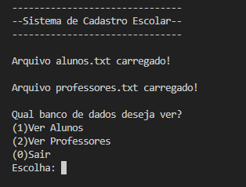
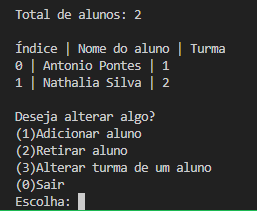
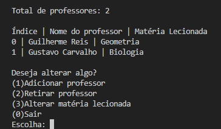

# 📄 Sistema de Cadastro 📄

## 📌 Projeto
Este programa é um **sistema de cadastro escolar** para controle de **alunos e professores**.

O objetivo deste projeto é o **aprendizado e treinamento da linguagem de programação C**, incluindo conceitos como:

- Estruturas (`struct`)
- Alocação dinâmica de memória (`malloc`, `realloc`, `free`)
- Manipulação de arquivos
- Organização modular de código
- Uso de `Makefile`

---

# 📂 Organização do Projeto

A arquitetura do projeto é a seguinte:

```arquitetura
Sistema de cadastro
 ┣ data
 ┃ ┣ alunos.txt
 ┃ ┗ professores.txt
 ┣ include
 ┃ ┣ Alteracao_de_dados.h
 ┃ ┣ Funcoes_interface.h
 ┃ ┣ Gerenciamento_de_structs.h
 ┃ ┣ Leitura_de_arquivos.h
 ┃ ┗ Sistema_de_cadastro.h
 ┣ src
 ┃ ┣ Alteracao_de_dados.c
 ┃ ┣ Funcoes_interface.c
 ┃ ┣ Gerenciamento_de_structs.c
 ┃ ┣ Leitura_de_arquivos.c
 ┃ ┗ Sistema_de_cadastro.c
 ┣ .gitignore
 ┣ Makefile
 ┗ README.md
```
- O diretório **data** contém os arquivos com os dados de alunos e professores.
- O diretório **include** contém os arquivos de cabeçalho (`.h`).
- O diretório **src** contém os arquivos fonte (`.c`) do programa.

---
# ⚙️ Como Compilar

O programa utiliza o compilador **GCC**.

Para facilitar a compilação foi criado um **Makefile**.

Abra o terminal no diretório do projeto e execute:

### Windows
```terminal
mingw32-make run
```
### Linux / MacOS
```terminal
make run
```
Esse comando irá:

1. Compilar o programa
2. Gerar o executável
3. Executar automaticamente o sistema

---

# 🖥️ Utilização do Programa

Ao iniciar, o programa:

1. Carrega os dados armazenados no diretório **data**
2. Exibe o menu principal para interação com o usuário
  

### Opção 1 — Alunos

Permite visualizar e alterar o banco de dados de alunos.


### Opção 2 — Professores

Permite visualizar e alterar o banco de dados de professores.


### Opção 0

Encerra o programa.

---

# 🚀 Funcionalidades atuais

O sistema atualmente permite:

- Visualizar alunos cadastrados
- Adicionar alunos
- Remover alunos
- Alterar turma de alunos
- Visualizar professores
- Adicionar professores
- Remover professores
- Alterar matéria lecionada

---

# 🔮 Planos futuros

Algumas melhorias planejadas para o projeto:

- Salvamento automático das alterações em arquivo
- Ordenação automática (ordem alfabética)
- Busca de alunos ou professores por nome
- Interface de menu mais robusta
- Melhor tratamento de entradas inválidas

---

# 📚 Objetivo do Projeto

Este projeto foi desenvolvido com fins **educacionais**, com o objetivo de praticar conceitos importantes da linguagem **C** e da organização de projetos maiores.